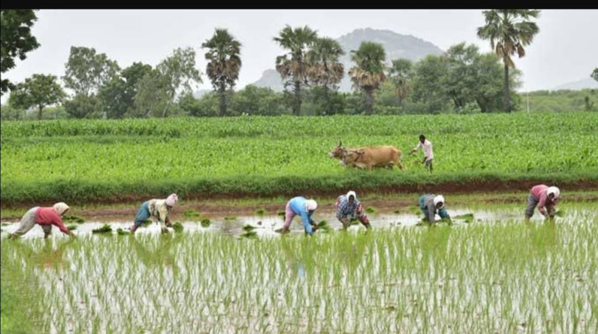
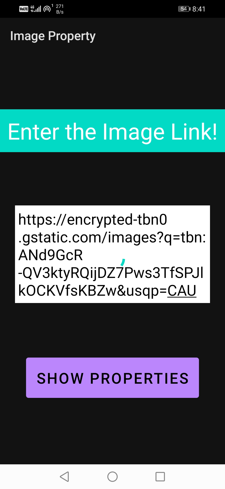
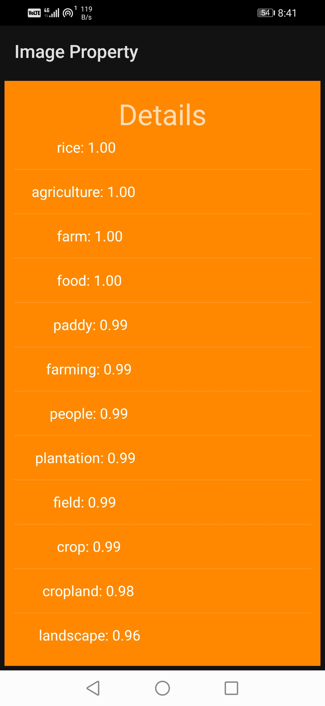
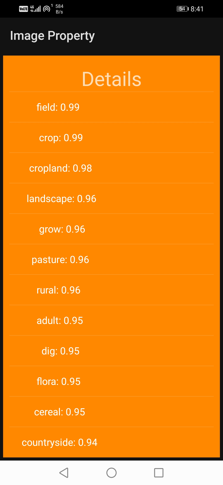

# Image_Property
### Enter/Paste any image url and the app will show you a list of details in image
#### Repository Link of used clarifai api: https://github.com/Clarifai/clarifai-java-grpc

  <h4> Sample Image </h4>

  <h4> Respective Link </h4>

  <h4> Output (Details in Image with their probability of correctness)</h4>

